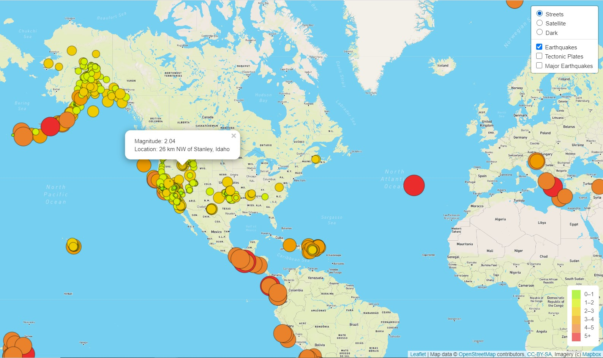
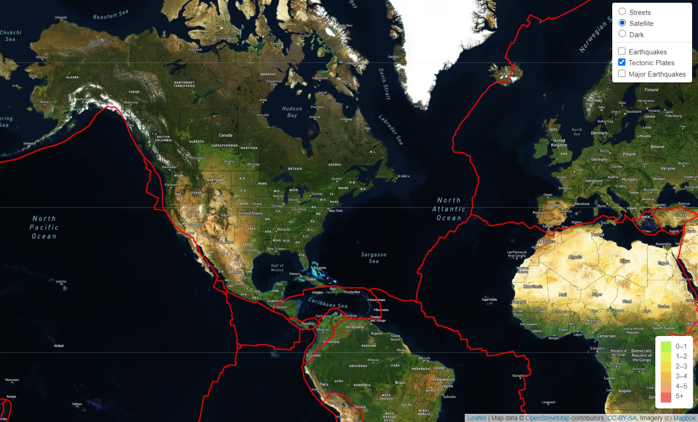
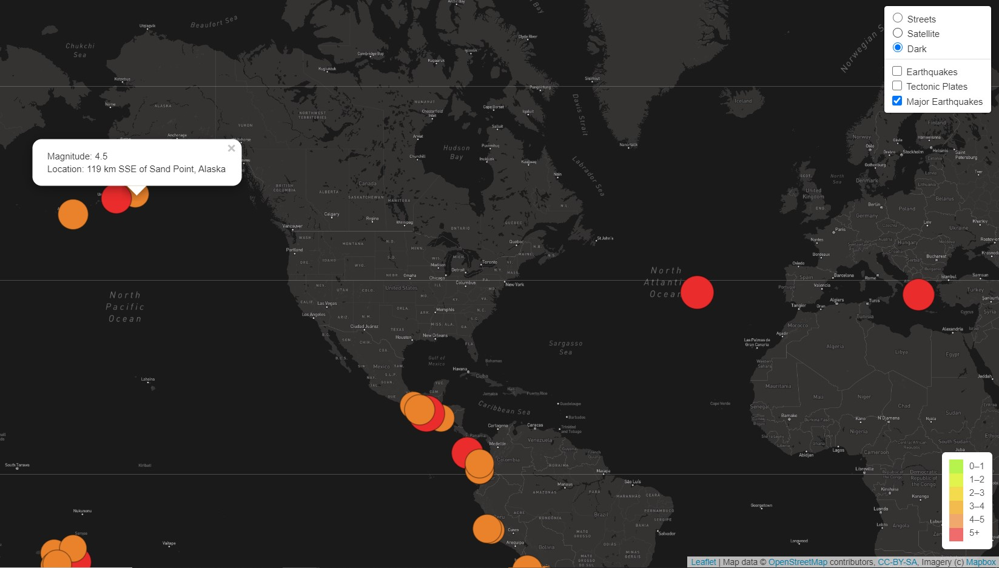
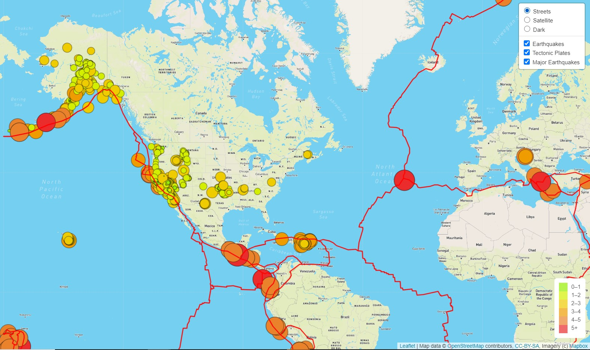
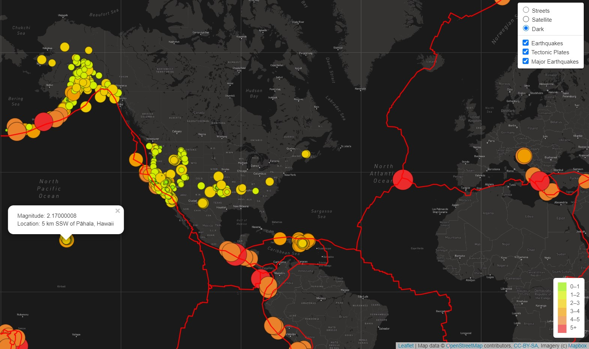

# Mapping_Earthquakes

## Background
The purpose of this project is to create a way for the  United States Geological Survey (USGS) to visualize earthquake data around the world. The USGS collects earthquake data globally on a daily bases, but does not have an adequate way to visually display the findings. The visualization will display the earthquakes that have occurred around the world in the last seven days, along with the magnitude of the earthquakes. 

## Results

### Earthquakes
The data for all earthquakes that have occurred in the last seven days are displayed, when the 'Earthquake' layer is applied. Additional, information about the location and magnitude of the earthquake can be found be clicking on a cirlcle. 

### Tectonic Plates
The tectonic plate data was added to the map, to allow users to view all of the known plates globally.  Additional, information about the location and magnitude of the earthquake can be found be clicking on a cirlcle. 

### Major Earthquakes
A layer to identify Major Earthquakes that have occurred in the last seven days was also added to the map. Additional, information about the location and magnitude of the earthquake can be found be clicking on a circle. The radius of each circle indicates the size and magnitude of the earthquake. 

### Overview of map with all layers turned on. 

### Dark 
An additional map was created to provide a dark view of the map, which makes it easier to view tectonic plates and the location of earthquakes.

##  Tools
VS Code, Mapbox, JSON, GeoJSON, data provided by the United States Geological Survey
